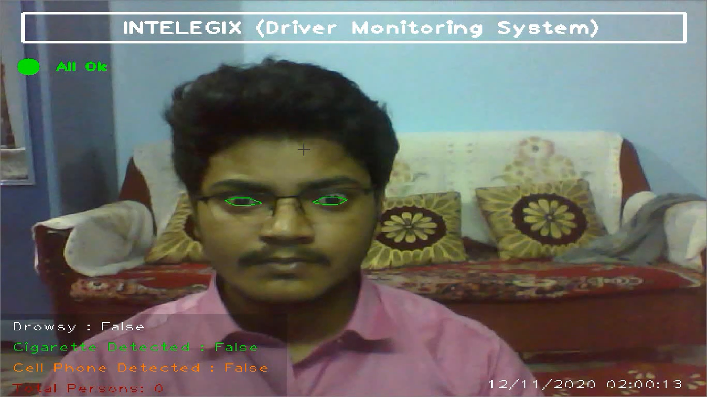
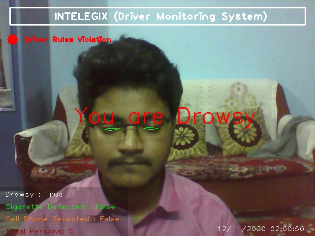
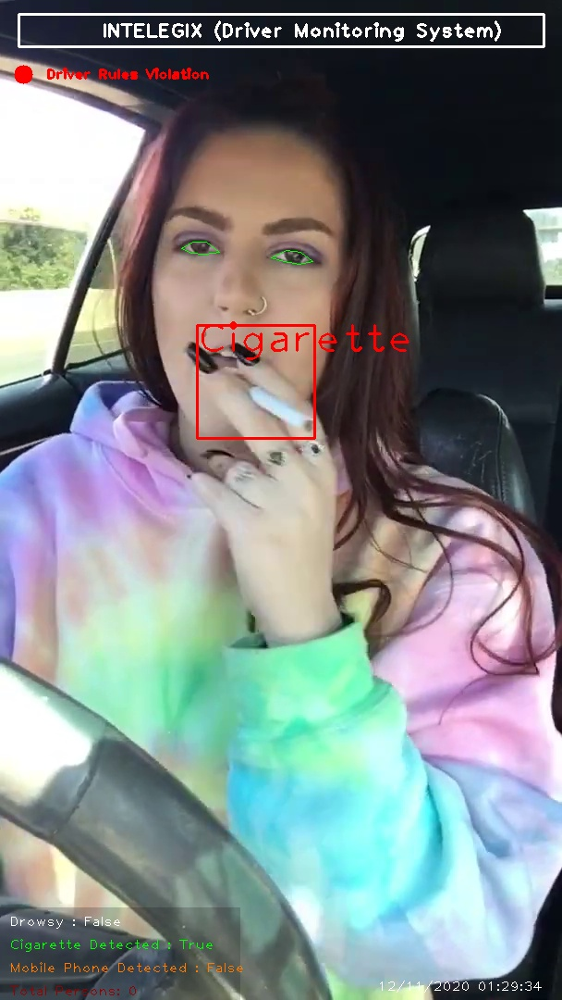
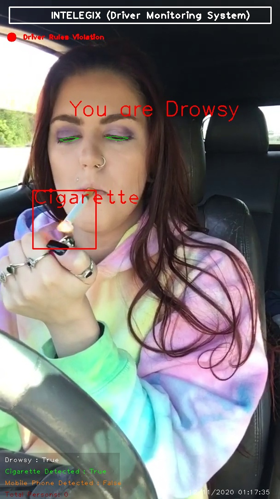

# AI DRIVER MONITORING SYSTEM

Project to monitor driver behiviour while driving. If the application detects driver rules violation done by driver then it sends a warning/image to a Telegram/Whats App/Email through REST API.

##### PROBLEM STATEMENT

School Buses: Driver drowsy, driver talking on cellphone while driving, driver/conductor smoking in the bus etc

### Prerequisites


For Application:
```
opencv-python==4.4.0.44
requests==2.24.0
configparser==5.0.1
tensorflow==2.3.1
scikit-learn==0.23.2
wget==3.2
pygame==2.0.0
dlib==19.21.0
imutils==0.5.3
```


## DETECTION RESULT

<p align="center">
    
    <br>
    <sup><a href="https://github.com/raj713335/AI_DRIVER_MONITORING_SYSTEM" target="_blank"><strong>AI DRIVER MONITORING SYSTEM</strong></a></sup>
</p>


## Vision

It has three vision based functionalities right now:

1. Detects if a Driver is drowsy.
2. Uses a custom trained model based on yolov4 Darknet architecture to detect if a person is smoking while driving.
3. Uses a custom trained model based on yolov4 Darknet architecture to detect if a person is using cell phone while driving.


### When there is no detection of Driver Rules Violation 




### Face detection

Earlier, Dlib's frontal face HOG detector was used to find faces. However, it did not give very good results. In face_detection different face detection models are compared and OpenCV's DNN module provides best result and the results are present in
It is implemented in `AI_DRIVER_MONITORING.py` and is used for tracking eyes, mouth opening detection and head pose estimation.


### Facial Landmarks to detect if driver is Drowsy

To give landmarking on the eyelashes and if two lines on upper and lower eyelashes intersect the the application gives a warning message indicating the driver is Drowsey.

It is implemented in `AI_DRIVER_MONITORING.py` and is used for tracking eyes,and eyelashes.




### Smoking and cellphone Detection while driving 

`AI_DRIVER_MONITORING.py` is for detecting drivers using mobile phones and smoking while driving . It is based on a custom trained yolov4 architecture based Darknet Model.

Tips to train a custom based yolov4 based object Detection model you can refer to https://blog.roboflow.com/train-a-tensorflow2-object-detection-model/







